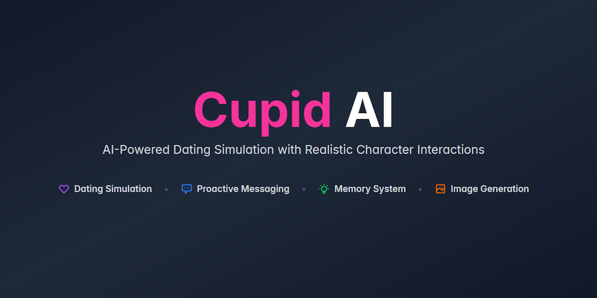
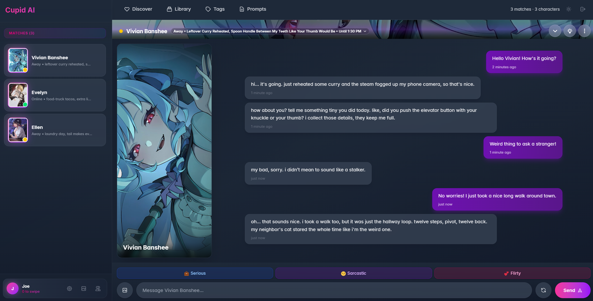

# Cupid AI

AI-Powered Dating Simulation with Realistic Character Interactions



## Overview

Cupid AI is a dating app simulator where you interact with characters that try to exhibit realistic behavior patterns. Characters have schedules, personalities, memories, and can proactively reach out to you. Uses multiple LLMs to create engaging, dynamic conversations that feel authentic.

## Why Cupid?

Most AI roleplay projects have limited memory, focused on action rather than communication. Characters tend to do whatever you say, which I found boring after a while.

Cupid solves most issues with activities, online statuses and great image generation. Characters have their own life, stick around for a while then go do their thing. They naturally say goodbye, have moods, show off whatever they're doing. It won't replace your other roleplay apps, rather it's more for chilling out and chatting with whoever is online. 

Along with important memories saved and message compaction, the chat's can go on for a long time with less context loss. Overall a neat package for people who like talking a lot.

If you like the layout but not the specific aspects, I've created a template app: https://github.com/ForgottenHistory/AI-Chat-Template 



## Key Features

### Characters
- **Import character cards** (PNG v2 format) or use the **Character Wizard** to generate new characters
- Dating profiles with interests, fun facts, and preferences
- Weekly schedules with online/away/busy/offline patterns
- Big Five (OCEAN) personality traits that influence behavior
- Tinder-style discovery (like/pass system with undo) (might change later)

### Chat System
- **Triple LLM Architecture**: Separate models for content generation, decision-making, and image tagging
- **Proactive Messaging**: Characters initiate conversations after time gaps (personality-based probability)
- **Schedule-Based Engagement**: Characters respond differently based on their current status and activities
- **Time-Aware Conversations**: Automatic time gap markers and context-appropriate responses
- **Memory System**: AI extracts and stores up to 100 important facts of you per character
- **Conversation Compacting**: Automatic AI summarization to manage context window efficiently
- **Character Mood System**: Dynamic emotional state (e.g., "feeling flirty and playful")
- **Mood Effects**: Dynamic chat backgrounds based on conversation tone and message reactions

### Image Generation
- **Stable Diffusion Integration**: Context-aware image generation during conversations
- **Smart Image Decisions**: AI decides when to send images (not just on request - can tease or refuse)
- **Danbooru Tag System**: Separate LLM generates appropriate tags for character images
**Result:** Varied pictures based on character activities

### Extensive Customization

**Behavior Settings:**
- Proactive messaging frequency, cooldowns, and daily limits
- Conversation compacting thresholds (percentage-based)
- Memory system capacity (0-100 memories per character)
- Auto-unmatch for inactive conversations
- Daily swipe limits (0 = unlimited)
- Max consecutive proactive messages before auto-unmatch

**LLM Configuration (3 Independent Systems):**
- **Content LLM**: Generates character responses and conversations
- **Decision LLM**: Makes behavioral decisions (reactions, moods, unmatch, voice/image)
- **Image Tag LLM**: Generates Danbooru tags for Stable Diffusion

Each LLM has separate provider (OpenRouter/Featherless), model, temperature, tokens, and parameters.

**AI Prompt Customization:**
- System prompts (conversation style, pacing, NSFW handling)
- Decision engine prompts (reaction rules, mood criteria, image/voice decisions)
- Proactive messaging templates (fresh start, callbacks)
- Memory extraction rules (importance scoring, fact selection)
- Conversation compaction instructions

## Quick Start

### Prerequisites

Node.js 18+

One LLM provicer:
- OpenRouter API key ([get one here](https://openrouter.ai/))
- Featherless API key ([get one here](https://featherless.ai/))

Optional:
- Stable Diffusion WebUI (for image generation)

### Installation

1. **Clone the repository**
```bash
git clone https://github.com/yourusername/cupid-ai.git
cd cupid-ai
```

2. **Install dependencies**
```bash
# Backend
cd backend
npm install

# Frontend
cd ../frontend
npm install
```

3. **Configure environment variables**

Look at .env.example for reference

Create `backend/.env`:
```env
PORT=3000
FRONTEND_URL=http://localhost:5173
JWT_SECRET=your-random-secret-here

# LLM providers (can use both)
OPENROUTER_API_KEY=your-openrouter-key
OPENROUTER_BASE_URL=https://openrouter.ai/api/v1
FEATHERLESS_API_KEY=your-featherless-key

# Optional: Image Generation
SD_SERVER_URL=http://127.0.0.1:7860
IMAGE_MESSAGES_ENABLED=true
```

4. **Start the application**
```bash
# Terminal 1: Backend (port 3000)
cd backend
npm start

# Terminal 2: Frontend (port 5173)
cd frontend
npm run dev
```

5. **Open your browser**
Navigate to `http://localhost:5173`

## Usage Guide

### Getting Started
1. **Sign up** for an account or log in (stored offline)
2. **Import characters** from PNG cards or create new ones with the Character Wizard
3. **Configure your LLM settings** in Profile → LLM Settings (choose models for Content/Decision/Image Tag)
4. **Swipe on characters** in the Discover tab (right = like, left = pass)
5. **Chat with matches** and enjoy

### Pages Overview

**Discover:** Swipe interface for character discovery
**Chats:** Main chat window
**Library:** Manage imported characters & create characters

**Settings**
- **LLM Settings**: Configure Content/Decision/Image Tag LLMs
- **Behavior Settings**: Customize proactive messaging, compaction, memory, swipe limits
- **SD Settings**: Configure Stable Diffusion parameters
- **Prompts**: Edit AI behavior prompts
- **Tag Library**: Manage Danbooru tag library for image generation
- **Voice Library**: Manage TTS voices (future feature)

## Advanced Features

### Memory System
- AI extracts 2-5 important facts per conversation block
- Memories are scored by importance (0-100)
- Lowest importance memories pruned when capacity reached
- Configurable cap: 0 (disabled) to 100 memories per character
- Memories persist across conversations and compaction

### Conversation Compacting
- Automatically summarizes old messages to save context window space
- Triggers at 90% of context window (configurable)
- Compacts down to 70% of context window (configurable)
- Keeps last 30 messages uncompacted (configurable)
- Small blocks (<15 messages) deleted, large blocks summarized
- Maximum 5 summary slots (oldest deleted when creating 6th)
- Can be fully disabled in Behavior Settings

### Decision Engine
Separate LLM analyzes conversations every message to decide:
- **Reactions**: Emoji reactions (rare, only for significant messages)
- **Moods**: Special backgrounds (hearts/stars/laugh/sparkles/fire/roses)
- **Character Mood**: Free-form emotional state
- **Unmatch**: Extremely rare, for serious violations
- **Voice Messages**: Emotional moments, personality-based (disabled)
- **Image Sending**: Context-aware, can tease or refuse requests
- **Thoughts**: Internal monologue (every 10th message)

### Proactive Messaging
Characters initiate conversations based on:
- Time since last message (increases probability over time)
- Character's extraversion level (-25% to +25% modifier)
- Current online status from schedule
- Daily limit (5 messages per day default)
- Message type decisions (fresh start, callback, resume)

### Character Wizard
Generate AI characters in 4 steps:
1. **Identity**: Select age, archetype, personality traits
2. **Description**: AI generates name and detailed character description
3. **Image**: AI generates appearance description and profile picture
4. **Options**: Auto-generate dating profile, schedule, and personality traits

## Development

### Tech Stack

**Frontend:**
- React + Vite
- Tailwind CSS
- IndexedDB (character storage)
- Socket.IO (real-time chat)

**Backend:**
- Node.js + Express
- SQLite (better-sqlite3)
- JWT Authentication
- Socket.IO
- Multi-provider LLM support (OpenRouter, Featherless)

**External Services:**
- OpenRouter / Featherless (LLM providers)
- Stable Diffusion WebUI (image generation)

### Project Structure
```
cupid-ai/
├── backend/
│   ├── src/
│   │   ├── db/              # Database schema and migrations
│   │   ├── routes/          # API endpoints (auth, chat, characters, etc.)
│   │   ├── services/        # Business logic (AI, memory, compaction, etc.)
│   │   ├── middleware/      # Authentication, validation
│   │   └── utils/           # Helpers, logger
│   ├── config/              # prompts.json (configurable AI prompts)
│   ├── logs/                # Auto-cleaning logs (10-minute rolling)
│   └── uploads/             # Generated images
├── frontend/
│   ├── src/
│   │   ├── components/      # Reusable UI components
│   │   ├── pages/           # Route pages
│   │   ├── hooks/           # Custom React hooks
│   │   ├── services/        # API clients, IndexedDB, WebSocket
│   │   ├── context/         # React contexts (Auth, Mood)
│   │   └── utils/           # Helpers, debug tools
│   └── public/              # Static assets
├── CLAUDE.md                # Technical documentation for AI
├── FILE_REGISTRY.md         # Detailed file documentation
└── IDEAS.md                 # Feature roadmap
```

### Logging
- Location: `backend/logs/`
- Auto-cleanup: Logs older than 10 minutes deleted every 60 seconds. 
- Types: Server logs, prompt logs, LLM response logs. Only 5 logs saved at a time per type.

## Contributing

Contributions are welcome! Feel free to submit issues or pull requests. Especially for other LLM & Image & Voice providers support

## License

MIT License - see LICENSE file for details

## Acknowledgments

- Character card format based on [TavernAI character spec](https://github.com/TavernAI/TavernAI)
- Stable Diffusion integration via [AUTOMATIC1111 WebUI](https://github.com/AUTOMATIC1111/stable-diffusion-webui)
- LLM providers: [OpenRouter](https://openrouter.ai/), [Featherless](https://featherless.ai/)
