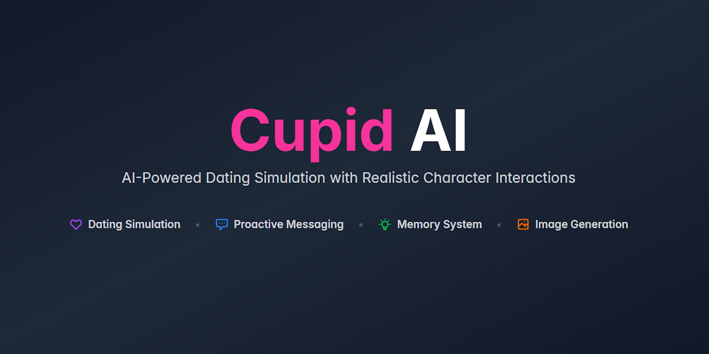

# Cupid AI v1.0.0 - Initial Release

**First public release of Cupid AI!**

Cupid AI is a dating app simulator where you interact with AI-powered characters that exhibit realistic behavior patterns. Characters have schedules, personalities, memories, and can proactively reach out to you.



## Highlights

### Triple LLM Architecture
- **Content LLM**: Generates character responses and conversations
- **Decision LLM**: Makes behavioral decisions (reactions, moods, unmatch, voice/image)
- **Image Tag LLM**: Generates Danbooru tags for Stable Diffusion
- Each LLM can use different providers (OpenRouter/Featherless) with independent configuration

### AI Characters
- Import character cards from PNG v2 format
- Character Wizard for AI-generated characters (4-step process)
- AI-generated names, descriptions, appearances, and profile pictures
- Dating profiles with interests, fun facts, and preferences
- Weekly schedules with realistic online/away/busy/offline patterns
- Big Five (OCEAN) personality traits that influence behavior

### Realistic Chat System
- **Proactive Messaging**: Characters initiate conversations after time gaps
- **Schedule-Based Engagement**: Characters respond differently based on their current status
- **Memory System**: AI extracts and stores up to 100 important facts per character (configurable 0-100)
- **Conversation Compacting**: Automatic AI summarization to manage context window efficiently
- **Message Reactions**: Characters react with emojis to emotionally significant messages
- **Mood Effects**: Dynamic chat backgrounds based on conversation tone

### Image Generation
- Stable Diffusion WebUI integration
- Context-aware image generation during conversations
- Smart AI decisions (can send, tease, or refuse requests)
- Character profile picture generation

### Social Features
- Tinder-style swipe interface (like/pass with undo)
- Daily auto-match system (configurable)
- Super likes (personality-based, 2 per day, guarantees first message)
- Social media feed with character posts
- Match management with unread indicators

### Extensive Customization
- Behavior settings (proactive messaging, memory, compaction, swipe limits)
- LLM configuration (3 independent systems with separate providers)
- Stable Diffusion settings (sampling, CFG, resolution, ADetailer)
- AI prompt customization (system prompts, decision engine, memory extraction)
- Tag library management for image generation

## Tech Stack

**Frontend:** React + Vite, Tailwind CSS, IndexedDB, Socket.IO
**Backend:** Node.js + Express, SQLite, JWT Authentication, Socket.IO
**External Services:** OpenRouter / Featherless (LLM providers), Stable Diffusion WebUI (optional)

## Getting Started

### Prerequisites
- Node.js 18+
- OpenRouter API key ([get one here](https://openrouter.ai/))
- Featherless API key (optional, [get one here](https://featherless.ai/))
- Stable Diffusion WebUI (optional, for image generation)

### Quick Start

1. Clone the repository
```bash
git clone https://github.com/ForgottenHistory/Cupid-AI.git
cd Cupid-AI
```

2. Install dependencies
```bash
# Backend
cd backend
npm install

# Frontend
cd ../frontend
npm install
```

3. Configure environment variables
- Copy `backend/.env.example` to `backend/.env`
- Add your OpenRouter API key (required)
- Add your Featherless API key (optional)
- Configure SD server URL (optional, for images)

4. Start the application
```bash
# Terminal 1: Backend
cd backend
npm start

# Terminal 2: Frontend
cd frontend
npm run dev
```

5. Open your browser at `http://localhost:5173`

## Documentation

- **README.md**: Complete feature documentation
- **CHANGELOG.md**: Version history
- **backend/.env.example**: Environment configuration guide

## Known Limitations

- Voice messages feature not yet implemented (marked as future feature)
- Left-on-read feature currently disabled
- Character names may default to "Character" when syncing to backend (cosmetic)

## Contributing

Contributions are welcome! This is a hobby project, so feel free to:
- Report bugs via GitHub Issues
- Submit pull requests with improvements
- Share feedback and suggestions

## License

MIT License - see [LICENSE](LICENSE) file for details

---

**Full Changelog**: https://github.com/ForgottenHistory/Cupid-AI/blob/master/CHANGELOG.md
